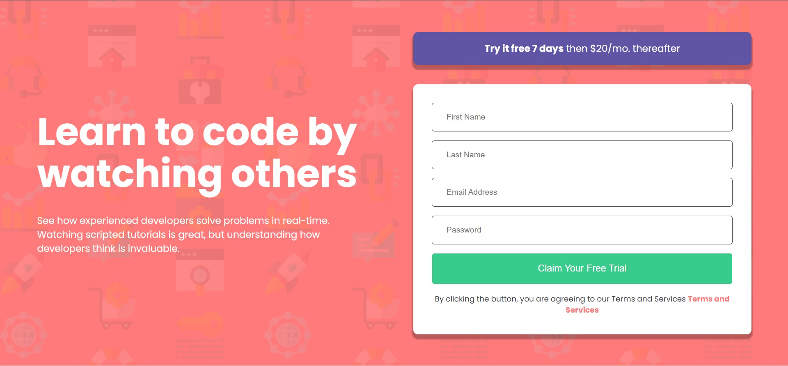
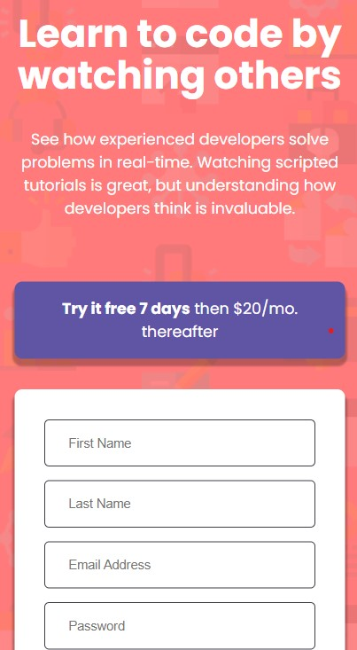

# Frontend Mentor - Intro component with sign up form solution

This is a solution to the [Intro component with sign up form challenge on Frontend Mentor](https://www.frontendmentor.io/challenges/intro-component-with-signup-form-5cf91bd49edda32581d28fd1). Frontend Mentor challenges help you improve your coding skills by building realistic projects. 

## Table of contents

- [Overview](#overview)
  - [The challenge](#the-challenge)
  - [Screenshot](#screenshot)
  - [Links](#links)
- [My process](#my-process)
  - [Built with](#built-with)
  - [What I learned](#what-i-learned)
  - [Continued development](#continued-development)
  - [Useful resources](#useful-resources)
- [Author](#author)
- [Acknowledgments](#acknowledgments)

**Note: Delete this note and update the table of contents based on what sections you keep.**

## Overview

### The challenge

Users should be able to:

- View the optimal layout for the site depending on their device's screen size
- See hover states for all interactive elements on the page
- Receive an error message when the `form` is submitted if:
  - Any `input` field is empty. The message for this error should say *"[Field Name] cannot be empty"*
  - The email address is not formatted correctly (i.e. a correct email address should have this structure: `name@host.tld`). The message for this error should say *"Looks like this is not an email"*

### Screenshot






### Links

- Solution URL: [Add solution URL here](https://your-solution-url.com)
- Live Site URL: [Add live site URL here](https://your-live-site-url.com)

## My process

### Built with

- Semantic HTML5 markup
- CSS custom properties
- Flexbox
- CSS Grid
- Vanilla JavaScript

### What I learned

*I learned to use the ':root' element better.
*It was tough at first figuring out how to use the warning fill in my HTML but with the help of chatGPT, I was  able to apply it to my project.
*One more thing I learned is that projects truly build experience, doing this project has motivated me to do more Front-end mentor projects not to procastinate or feel like an imposter but to sharpen my skills and prepare myself for the job market! 

These are some lines I am proud of: 

```html
              <i class="ri-error-warning-fill"></i>

```
```css
body{
    background-color: var(--primary-red);
    background-color: var(--primary-red);
    color: #fff;
    background-image: url(images/bg-intro-desktop.png);
    min-height: 100vh;
    font-family: 'Poppins';
    display: grid;
    place-content: center;
}
```
```js
 if(isValid) {
        alert('Form submitted successfully!')
    }
```

If you want more help with writing markdown, we'd recommend checking out [The Markdown Guide](https://www.markdownguide.org/) to learn more.


### Continued development

I'd love to get into more effective css practices and use JavaScript more effectively.

### Useful resources

- (https://chatgpt.com/) - This has always helped me through projects and it helped me yet again. I preach chatGPT!


## Author

- Instagram - [username : she_codes18]
- Frontend Mentor - [@Grace406](https://www.frontendmentor.io/profile/Grace406)
- Twitter - [@shecodes06](https://www.twitter.com/shecodes06)


## Acknowledgments

I want to thank developer YouTubers, a lot of their videos helped me altogether !
